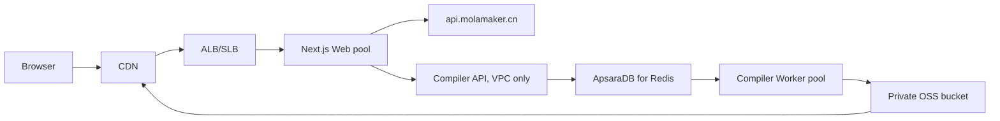

# TikZ Studio v3 架构调研

- 日期：2026-07-27
- 生产目标：阿里云 ECS + OSS + CDN 的公开服务网站
- 调研方法：Tavily 广泛检索、GitHub 上游仓库核对、现有代码与 fixture 审计
- 最终规格：[TikZ Studio v3 architecture design](../specs/2026-07-27-tikz-studio-v3-architecture-design.md)

## 结论

最稳妥的长期架构不是“Scene 作为真源”，也不是“每一帧调用 TeX 验证”，而是：

1. TikZ 源码与 CodeMirror transaction 是唯一持久事实；
2. Lezer CST、语义图、约束图和 Scene 都是绑定 `sourceRevision` 的派生投影；
3. 交互 SVG 负责低延迟编辑，服务端 Tectonic/dvisvgm 负责异步保真预览；
4. 派生点拖拽通过可替换的 `SolverPort` 反求上游驱动变量；
5. TeX 在独立 Worker 容器执行，Next.js 只管理 job；
6. Redis 负责任务去重、可靠领取、租约和 fencing，SVG 进入 OSS；
7. CDN 只缓存版本化静态资产和授权公开的内容寻址产物。

这套构型把编辑响应、TikZ 兼容性、编译安全、云端扩缩容和缓存隐私分开处理，
不会让任何单个子系统成为第二真源。

## 关键选型

| 领域 | 采用 | 暂不采用 | 原因 |
|---|---|---|---|
| 文本与增量语法 | CodeMirror 6 transaction + Lezer LR CST | React 字符串镜像、正则 statement diff | transaction 原生描述变更；Lezer 支持错误恢复与增量复用 |
| 稳定身份 | UUID + `ChangeDesc` range mapping + 邻接 reconciliation | 内容 hash 作为实体 ID | 内容变化不应改变对象身份 |
| 交互真源 | TikZ source | Scene / React state / solver state | 保留注释、格式和未知 TikZ |
| 实时渲染 | 语义投影到 SVG | pointer-move 中运行 TeX、WASM 或 pixel diff | 交互路径必须稳定在帧预算内 |
| 精确渲染 | Tectonic `--untrusted --only-cached` → XDV → dvisvgm | Next 进程内 `node-tikzjax` | 隔离未可信 TeX；dvisvgm 原生支持 XDV |
| 约束求解 | Worker 后的可替换 `SolverPort` | 将派生点静默冻结为字面量 | 求解驱动自由度，保持几何关系 |
| 生产队列 | Redis reliable list + processing list + lease + attempt fencing | 单机内存队列、裸 `BRPOP` | 多实例、崩溃恢复、旧 Worker 结果隔离 |
| 产物 | OSS 内容寻址对象 + CDN | Web 容器本地持久盘 | 可横向扩展，适合 immutable 缓存 |

## 文档内核

### CodeMirror 与 Lezer

Lezer 官方说明其解析器面向编辑器，具备错误恢复和增量解析；`TreeFragment`
用于在变更后复用旧树的未修改部分。当前实现直接使用 CodeMirror 的语法树，
并把真实 `ChangeSet`、origin 和 revision 交给 `StudioDocument`。

重要限制：Lezer 复用的粒度不是实体身份系统。稳定实体 ID 仍需由
`ChangeDesc`、语法路径和邻接关系独立维护。

### Opaque preservation

自研语义层只解释明确支持的 TikZ subset。未知命令、宏、scope 或 option
必须作为 byte-preserving opaque source 保留：

- 可以交给精确编译器；
- 可能改变坐标系、样式或作用域时，将覆盖状态标为 `partial`；
- 不能安全定位写回范围时，禁止画布/属性面板改写；
- 不允许“重新序列化 Scene”覆盖未知源代码。

## 约束求解器

调研过的 PlaneGCS 来源主要来自 FreeCAD 派生仓库与第三方拆分仓库。它具备
CAD 级几何约束能力，但直接进入商业 Web 产品前仍需完成：

- 确认权威上游和维护关系；
- LGPL/GPL 链接与 WASM 分发方式的许可证评审；
- Emscripten/WASM 构建与浏览器 Worker 绑定；
- DOF、冲突集、分支连续性和取消协议的基准。

因此 v3 先锁定 `SolverPort`，使用轻量非线性最小二乘内核完成第一条派生拖拽链路，
而不是假装当前已经拥有完整 PlaneGCS：

- request/result 带 `sourceRevision` 和递增 sequence；
- latest-wins，旧结果丢弃；
- underconstrained 采用最小位移正则项；
- pointer-up 只写回可定位的上游字面量；
- 完整 constraint catalog、DOF/rank、冲突集和 branch token 仍是发布门禁。

## 精确 TeX 编译

### 为什么是 Tectonic + dvisvgm

Tectonic 官方 CLI 提供：

- `--untrusted`；
- `--only-cached`，拒绝按需联网获取资源；
- `--outfmt xdv`。

dvisvgm 官方说明支持 XeTeX XDV 5–7 到 SVG。因此两者可以组成无网络、
固定 bundle 的精确渲染路径。它仍不是安全沙箱本身，必须继续由 ECS 容器限制：

- 只读根文件系统；
- 唯一 job 临时目录；
- CPU、内存、进程数、wall time、输出大小限制；
- Worker 不开放端口；
- 无任意公网 egress；
- 单 Worker 同时只执行一个 TeX job。

`node-tikzjax`/浏览器 TikZJax 不作为生产 fallback：并发模型、包体、维护状态和
许可证都不如独立编译服务清晰，而且会把 TeX 重新带回 Web/浏览器主路径。

## Redis 可靠任务

Redis 官方 reliable queue 模式指出，裸 `RPOP/BRPOP` 会在 consumer 领取后崩溃时
丢消息；推荐 `LMOVE/BLMOVE` 原子移动到 processing list，再由 consumer 完成后
`LREM`。

本项目在该模式上增加：

- content-addressed deterministic job ID；
- 有界 waiting queue；
- processing list；
- running sorted-set lease；
- 心跳续租；
- 过期任务 Lua 原子回队；
- 每次领取递增 `attempt`；
- complete/fail 必须匹配 attempt，防止旧 Worker 覆盖新尝试；
- 成功 metadata 长 TTL、确定性失败短 TTL。

Redis 是 active job control plane，不是 SVG 的长期存储。

## ECS、OSS 与 CDN

推荐生产拓扑：

- Web 与 compiler API 独立扩容；
- Worker 按 queue depth 扩容，不挂负载均衡；
- Redis 使用托管高可用实例；
- OSS bucket 默认 private；
- ECS 到 OSS 使用 internal endpoint/PrivateLink；
- CDN 使用 private-bucket origin authentication；
- 只对 `/_next/static/*` 和公开的 `/tikz/v1/public/<sha256>.svg` 做长缓存；
- `/api/*`、鉴权响应、用户私有产物一律 `no-store`；
- ECS 使用 instance RAM role/短期 STS，禁止把长期 AccessKey 写入镜像或仓库。

## 本次代码状态与未决条件

| 能力 | 当前状态 |
|---|---|
| source-first transaction chain | 核心已实现；本地浏览器阶段验证通过，完整自动化仍待产品方执行 |
| Lezer CST + opaque 影响域 | 核心已实现，grammar 覆盖仍需扩展 |
| stable entity identity | 核心已实现，长文档 property test 待验证 |
| 派生点反求与 Worker 协议 | 第一版可替换内核已实现；不是完整 CAD solver |
| 独立 compiler API/Worker | 代码已实现；目标 ECS/容器验证待产品方执行 |
| Redis lease/fencing | 代码已实现；并发/故障注入待产品方执行 |
| OSS/CDN adapter | 代码已实现；RAM role 与目标 bucket 集成待验证 |
| 画板创作与属性写回 | 核心工具链已实现；本地浏览器已覆盖创建、拖拽、标签与坐标属性 |
| 生产切换 | 未批准；C2/D0 门禁未通过 |

2026-07-27 调研阶段没有执行测试。2026-07-28 经产品方追加授权，执行了非 Docker
的本地 Edge/Playwright CLI 阶段验证；未执行 Vitest、lint、build、性能、编译容器
或 ECS 测试，完整验收仍由产品方按交付清单执行。

## 主要来源

- [Lezer overview](https://lezer.codemirror.net/)
- [Lezer reference: TreeFragment](https://lezer.codemirror.net/docs/ref/)
- [CodeMirror reference](https://codemirror.net/docs/ref/)
- [Tectonic `-X compile`](https://tectonic-typesetting.github.io/book/latest/v2cli/compile.html)
- [Tectonic V1 CLI options](https://tectonic-typesetting.github.io/book/latest/ref/v1cli.html)
- [dvisvgm manual](https://dvisvgm.de/Manpage/)
- [Redis LMOVE reliable queue](https://redis.io/docs/latest/commands/lmove/)
- [Redis job queue with node-redis](https://redis.io/docs/latest/develop/use-cases/job-queue/nodejs/)
- [Tectonic GitHub](https://github.com/tectonic-typesetting/tectonic)
- [FreeCAD GitHub](https://github.com/FreeCAD/FreeCAD)
- [PlaneGCS standalone candidate](https://github.com/Salusoft89/planegcs)
- [Alibaba OSS access and network overview](https://www.alibabacloud.com/help/en/oss/user-guide/access-and-network-overview)
- [Alibaba OSS internal endpoints](https://www.alibabacloud.com/help/en/oss/user-guide/regions-and-endpoints)
- [Alibaba OSS bucket overview](https://www.alibabacloud.com/help/en/oss/user-guide/oss-bucket-overview)
