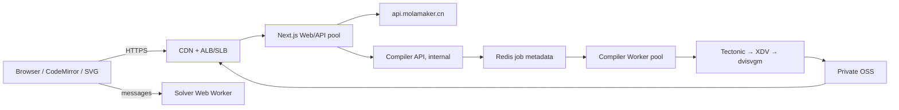

# TikZ Studio v3 架构规格

> v4 说明：本文件继续作为源码真源、双渲染、约束求解与 ECS 隔离编译的上位架构。画板交互、竞赛几何命令与 Apple 风格设计系统的增量规格见 [TikZ Studio v4 Apple Canvas](./2026-07-28-tikz-studio-v4-apple-canvas-design.md)。

- 日期：2026-07-27
- 状态：已批准，取代 v2 与旧双渲染方案
- 生产目标：ECS + OSS + CDN 的公开服务网站
- 调研依据：[v3 architecture research](../research/2026-07-27-tikz-studio-v3-architecture-research.md)

## 当前实施进度

| 工作包 | 状态 | 已有实现 | 仍需产品方验证/后续实现 |
|---|---|---|---|
| A0 编译可行性 | 开发机基线已有 | Tectonic/dvisvgm fixture 与 benchmark 脚本 | 目标 ECS 容器与并发数据 |
| A1 文档内核 | 核心已实现 | `StudioDocument`、revision、transaction origin、stable ID | 长文档、property、undo/redo 验证 |
| A2 增量语法 | 核心已实现 | Lezer LRLanguage/CST、opaque 影响域 | grammar 扩展和错误恢复验证 |
| A3 画板创作 | 核心工具链已实现 | 注册式 Tool、命中测试、创建/拖拽/属性最小 transaction | 扩展 constraint catalog 与高级 TikZ library 工具 |
| B1 交互投影 | 核心已实现 | revision-bound Scene、无旧 last-good Scene、stable SVG key | 浏览器交互与响应预算 |
| B2 约束求解 | 第一版内核 | SolverPort、Worker、latest-wins、派生点反求、原子写回 | 完整 constraint catalog、DOF、冲突集、branch token |
| C1 精确编译 | 代码已实现 | API/Worker 分离、Redis queue/lease/fencing、OSS/local artifact、job polling | 容器、恶意输入、并发、故障注入、ECS |
| C2 质量门禁 | 未完成 | 测试文件与验收命令已提供 | 由产品方执行全部测试 |
| D0 生产切换 | 未批准 | ECS+CDN 部署骨架 | C2 通过、灰度、回滚演练 |

“代码已实现”只表示当前源码结构，不等于已经通过容器、浏览器、ECS 或领域验收。

## 1. 不可变规则

1. **源码唯一真源**：TikZ source/CodeMirror transaction 是唯一持久事实。
2. **单一写入链**：键盘、AI、画布、样式、修复都生成最小 CodeMirror transaction。
3. **投影绑定 revision**：CST、语义图、Scene、solver result、exact artifact 都携带
   `sourceRevision`；旧结果不能覆盖新文档。
4. **未知语法不丢失**：subset 外语法保留为 opaque source；不安全区域禁止写回。
5. **交互与保真分离**：交互 SVG 同步；TeX 编译异步，不进入 pointer-move。
6. **派生关系优先**：拖拽派生对象时反求上游自由度；只有显式 detach 才能冻结。
7. **TeX 不可信**：不在 Next.js 进程执行，不共享 Web 文件系统，不允许任意网络。
8. **公开站点规则**：动态 API 在 ECS；CDN 不缓存用户态和鉴权响应。

## 2. 逻辑拓扑



## 3. 文档与 transaction

```ts
type TransactionOrigin =
  | 'keyboard'
  | 'ai'
  | 'canvas'
  | 'style'
  | 'repair'
  | 'external'

interface StudioDocumentSnapshot {
  revision: number
  source: string
  cstTree: Tree
  lastTransaction: {
    origin: TransactionOrigin
    beforeRevision: number
    afterRevision: number
    changes: ChangeDesc
  } | null
}
```

- 外部命令使用 `expectedRevision`，过期写入拒绝；
- 多 range 修改必须在一个 atomic transaction 中提交；
- 未触及 source slice 必须 byte-identical；
- CodeMirror 自己维护 undo/redo 历史；
- React 通过 `useSyncExternalStore` 订阅，不复制第二份文档状态。

### CST 与语义覆盖

```ts
type Coverage = 'complete' | 'partial' | 'invalid'

interface SemanticProjection {
  sourceRevision: number
  coverage: Coverage
  entities: ReadonlyMap<string, Entity>
  dependencyGraph: DependencyGraph
  sourceIndex: SourceIndex
}
```

- `complete`：当前语义层可安全解释和写回；
- `partial`：精确编译可用，但受 opaque 影响的区域禁止写回；
- `invalid`：不保留旧 Scene 伪装成功，改显示诊断/精确预览状态。

稳定身份首次创建为 UUID；后续通过 `ChangeDesc` range mapping、名称、语法路径和邻接
锚点 reconciliation。禁止使用内容 hash 作为实体身份。

## 4. SolverPort

```ts
interface SolveRequest {
  sourceRevision: number
  sequence: number
  target: { entityId: string; x: number; y: number }
  previousValues: Float64Array
  budgetMs: number
}

interface SolveResult {
  sourceRevision: number
  sequence: number
  status:
    | 'solved'
    | 'underconstrained'
    | 'overconstrained'
    | 'diverged'
    | 'cancelled'
  values?: Float64Array
  residual: number
  degreesOfFreedom: number
  conflictingConstraintIds: readonly string[]
}
```

交互协议：

1. pointer-down 找出依赖图的上游可写自由变量；
2. pointer-move 经 RAF 合帧，把目标点作为临时约束发给 Worker；
3. 主线程只接受相同 revision 的最大 sequence；
4. underconstrained 选最小位移解；
5. overconstrained/diverged 保持最后稳定预览，不提交源码；
6. pointer-up 只把驱动字面量范围作为一个 transaction 写回；
7. Esc 取消 sequence，源码不变。

当前非线性求解器是可替换初始内核，不宣称具备 PlaneGCS 全功能。

## 4.1 画板创作与对象属性

画板不是 Scene 编辑器。每个工具必须通过 `ToolContext` 生成最小 source patch，
由 `StudioDocument` 校验 `expectedRevision` 后原子提交；Scene 只负责下一 revision
的投影。

当前注册式工具目录：

- 导航：选择/拖拽、平移、滚轮缩放；
- 点线：自由点、线段、向量、直线、射线、折线；
- 面：多边形、矩形；
- 圆与标注：圆心+圆上一点、标签；
- 角：普通角、直角。
- 约束构造：两点中点、点到直线垂足。

多点工具以 Enter、双击或点击首点结束，Esc 取消未提交预览。空白处点击会分配
无冲突点名并把所需 `\coordinate` 与图元语句作为同一 transaction 插入
`\end{tikzpicture}` 前。

对象属性规则：

- 自由点允许拖拽或输入精确 X/Y，二者都只替换坐标 literal range；
- 派生点显示构造表达式，拖拽经 SolverPort 反求上游，不静默 detach；
- path/node/pic 支持颜色、线宽、线型、箭头、填充与透明度；
- 标签支持文字与九种锚点位置；未知 options 原样保留；
- 删除只移除被选语句及其尾随换行；
- AI、修复、键盘或外部重写文档后清空旧选择，避免旧 stmt index 命中新文档。

TikZ 的宏与 library 不是有限图元全集。任意未知命令仍可在源码中使用并由精确
编译器处理，但只有登记了 parser → semantic entity → hit-test → source patch
完整链路的类别才宣称可交互；禁止把 opaque 宏伪装成可编辑对象。

## 5. 双渲染

### 交互渲染

- `SemanticProjection → RenderSnapshot → SVG`；
- pointer-move 只允许 hit-test、solver 和 SVG 更新；
- 解析、TeX、source hash、PNG 或 pixel diff 禁止进入帧循环；
- exact result 只更新精确预览表面，不抢占交互画布。

### 精确渲染 job

```ts
type CompileJobRequest = {
  source: string
  profile: 'tikz-standard-v1'
  visibility: 'public' | 'private'
}

type CompileJobStatus = {
  id: `j_${string}`
  status: 'queued' | 'running' | 'succeeded' | 'failed'
  attempt: number
  artifactUrl?: string | null
}
```

`jobId = sha256(workerImageDigest + profile + visibility + exactSource)`。

- 相同 key 的 active/terminal job 去重；
- queue 有界，满载返回 429 和 `Retry-After`；
- waiting → processing 使用 Redis `BLMOVE`；
- running job 有 lease 与 heartbeat；
- expired job 由 Lua 原子回队；
- complete/fail 必须匹配 attempt fencing；
- 成功产物内容寻址且 immutable；
- 确定性失败短期负缓存；
- 浏览器轮询使用 `no-store`，AbortController 取消旧 revision。

### Worker 执行

1. 校验大小、UTF-8、profile allowlist；
2. 包入固定 `standalone` 模板；
3. 在唯一 tmp 目录运行 Tectonic `--untrusted --only-cached --outfmt xdv`；
4. dvisvgm 转 SVG；
5. 严格限制 wall time、CPU、内存、进程数、输出大小；
6. SVG 清洗后上传 OSS；
7. 写入 terminal job；单 Worker 同时只运行一个 job。

## 6. ECS + CDN 部署

- `web`：至少两个实例，ALB/SLB 健康检查 `/api/health`；
- `compiler-api`：内网服务，不包含 TeX，不暴露公网；
- `compiler-worker`：无端口，按 Redis queue depth 扩容；
- `redis`：ApsaraDB for Redis 高可用实例；
- `oss`：private bucket、internal endpoint/PrivateLink；
- `cdn`：private bucket 回源鉴权；
- `secrets`：ECS Secrets 或 instance RAM role/短期 STS；
- `images`：ACR 私有仓库，部署使用 image digest，不使用浮动 tag。

缓存矩阵：

| 路径 | CDN 策略 |
|---|---|
| `/_next/static/*` | `public, max-age=31536000, immutable` |
| `/tikz/v1/public/<sha256>.svg` 且文档公开 | immutable |
| `/tikz/v1/private/*` | bypass/no-store，仅鉴权 API |
| `/api/*` | bypass/no-store |
| 私有 SVG | 不给公开 CDN URL；鉴权 API 回源 |
| HTML/RSC | 短缓存或不缓存，按发布策略独立配置 |

## 7. 性能预算

| 路径 | 目标 |
|---|---|
| pointer → interactive SVG（100 entities） | p95 ≤ 16ms |
| solver component（100 variables） | warm p95 ≤ 8ms；超预算降到 30fps |
| source patch → semantic projection | p95 ≤ 50ms |
| exact compile metadata cache hit | p95 ≤ 100ms |
| exact compile miss | p95 ≤ 3s；hard timeout 10s |
| compiler queue | 有界；满载 429 |

开发机历史基线记录为 30/30 fixture cached compile 成功，平均 1,796ms、p95
2,319ms。该数据不是 ECS 容量承诺，本轮未重新执行。

## 8. 发布门禁（由产品方执行）

- unit/property：transaction、CST、opaque preservation、identity、solver；
- integration：真实 Redis queue、租约、fencing、artifact；
- adversarial compiler：`\input`、`\write18`、外链、超时、超大输出；
- browser：代码→图、自由点/派生点拖拽、撤销、opaque fallback、stale exact；
- performance：交互帧、semantic compile、队列、冷/热编译；
- ECS：多架构镜像、只读文件系统、无网 Worker、OOM/kill 恢复；
- deployment：CDN cache key、private OSS 回源、secret rotation、rollback。

C2 全部通过并完成灰度前，不得宣称生产切换完成。

### 2026-07-28 本地浏览器阶段证据

本轮按产品方后续授权，仅使用本地 Next.js + Edge/Playwright CLI，未使用 Docker，
也未运行 Vitest、lint、build 或性能套件：

- `api.molamaker.cn` 实时模型目录可读取，MiniMax-M2.5 的“画一个九点圆”请求
  返回 200；
- 生成结果投影为 16 个构造点、28 个交互图元，局部 opaque `\fill ... circle`
  保留在源码中且没有自动请求 `/api/tikz/render`；
- 生成后从画板新增自由点，源码原子追加
  `\coordinate (P1) at (...);`；
- 浏览器验证了线段、圆、矩形、多边形、角、标签创建，以及自由点拖拽；
- 向量、中点和垂足工具写回 `\draw[->]`、插值与投影 calc 表达式；
- 标签选择、文字、位置、颜色和删除均回写最小语句范围；`circle through`
  等非托管 option 未丢失；
- 自由点 X/Y 编辑与派生点只读约束信息可用；
- 原生 non-passive wheel handler 完成缩放，干净浏览器会话控制台为 0 error；
- relay 的 delta 后完整 message 快照已去重，复测回答只有一个 tikzpicture。

这些证据只覆盖本地浏览器路径，不替代本节列出的完整 C2、隔离编译容器或 ECS
验收。

## 9. 明确不做

- 不做每帧 TeX/WASM/pixel oracle；
- 不把 Scene、React 或 solver state 变成第二真源；
- 不在 Next API 进程执行 TeX；
- 不自动断开派生依赖；
- 不尝试把任意宏反编译成可拖拽几何；
- 不把 Sites/Cloudflare Worker 约束当作 ECS 生产架构；
- 不在未完成许可证审查前分发 PlaneGCS WASM。
