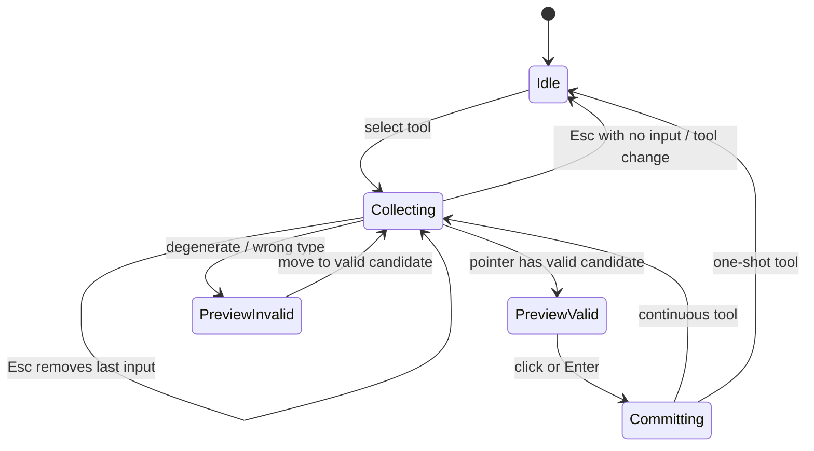

# TikZ Studio v4 Apple Canvas 设计规格

- 日期：2026-07-28
- 状态：架构重构与代码 Foundations 已落地；本地浏览器复核和产品方执行验收待完成
- 目标：面向竞赛几何教师的源码原生、可证明、可直接操纵画板
- 视觉方向：Apple Freeform / macOS 工具层级，非视觉仿制
- 架构依赖：[TikZ Studio v3 architecture design](./2026-07-27-tikz-studio-v3-architecture-design.md)
- 调研依据：[v4 Apple Canvas research](../research/2026-07-28-tikz-studio-v4-apple-canvas-research.md)
- 主页面依据：[Workspace Dashboard information architecture](../research/2026-07-29-workspace-dashboard-information-architecture.md)
- Figma：[Math GeoHub v4 — Apple Canvas Design System](https://www.figma.com/design/UwhTraUjVHgTmXvQuFweZi)
- Figma 写入边界：文件已创建，但当前账号为 View 席位，Design API 的写操作返回
  `INVALID_ARGUMENT`；代码实现不以 Figma 写入成功作为运行时依赖，获得 Edit 席位后再同步
  variables、components 和 responsive screens

## 1. 规格边界

v4 是 v3 之上的 interaction、authoring grammar 和 design-system 扩展，不替换以下不变量：

1. TikZ source 是唯一持久化真源；
2. 所有写入都是最小 CodeMirror transaction；
3. semantic scene、dependency graph、solver result、exact artifact 都绑定 source revision；
4. 交互 SVG 与精确 TeX 编译是两条独立通道；
5. TeX 只在隔离 ECS compiler service 执行；
6. 不支持的 TikZ 区域 byte-preserving，无法安全回写时禁止画板修改；
7. 动态 API 与编译控制在 ECS，静态资产和授权产物通过 OSS/CDN。

## 2. 产品原则

### 2.1 直接操纵，但不隐藏源码

用户可以从工具条、命令面板、快捷键、画板或源码开始操作。所有入口最终生成同一种 source transaction，并提供对应的画板和源码反馈。

### 2.2 高级构造是有类型的命令

反演、根轴、完全四边形不是一段孤立模板，而是声明了输入、输出、约束、退化条件、预览与源码编译策略的 `ConstructionToolSpec`。

### 2.3 关系可解释

选择对象后，系统能展示：

- Geometry：坐标、定义、可驱动自由度；
- Style：TikZ style、标签、层级、可见性；
- Relations：祖先、后代、约束、构造命令与源码位置。

### 2.4 运动只解释状态变化

指针跟随不加延迟；动画用于说明选中、吸附、提交、生成、错误和面板关系。任何动效都不能成为几何计算或文档状态的一部分。

## 3. 信息架构

### 3.1 Desktop 1440

```text
┌──────────────────────────────────────────────────────────────────────────────┐
│ Back  Document title     [Navigate][Primitive][Constraint][Transform][⋯]   │
├───────────────┬───────────────────────────────────────────┬──────────────────┤
│ Command / AI  │                                           │ Inspector        │
│               │                 Canvas                    │ Geometry Style   │
│ Search        │                                           │ Relations        │
│ Recent tools  │       contextual preview / handles        │                  │
│ Teacher tools │                                           │                  │
│               ├───────────────────────────────────────────┤                  │
│               │ CodeMirror source (collapsible dock)      │                  │
└───────────────┴───────────────────────────────────────────┴──────────────────┘
```

- 顶部：浮动紧凑工具条，按任务分组；
- 左侧：AI 与 command deck，共享模型选择但不遮蔽画板；
- 中央：无玻璃覆盖的几何内容层；
- 右侧：上下文检查器；
- 源码：底部 dock，可调整高度、折叠或扩展；
- 精确预览：按需切换，不覆盖交互画板状态。

### 3.2 1024

- 左侧 command deck 收为 overlay；
- 右侧 inspector 保持 288–320 px；
- source dock 默认 34% 高度；
- 工具条只显示类别与当前工具，子命令使用 popover。

### 3.3 768 及以下

- Canvas 是主表面；
- toolbar 为底部 compact shelf；
- inspector 与 source 分别进入全高 sheet；
- 不在同一时刻强制显示三栏；
- 所有核心工具都可通过 command search 与键盘访问。

## 4. 视觉 Foundations

所有 tokens 先作用于 `.tz-studio` scope，避免重写站点全局暖色品牌。

### 4.1 Color roles

```css
.tz-studio {
  --tz-canvas: #f7f7f8;
  --tz-grid-minor: rgba(31, 35, 41, 0.045);
  --tz-grid-major: rgba(31, 35, 41, 0.085);
  --tz-panel: rgba(250, 250, 252, 0.88);
  --tz-panel-solid: #fbfbfc;
  --tz-ink: #1d1d1f;
  --tz-muted: #6e6e73;
  --tz-divider: rgba(60, 60, 67, 0.18);
  --tz-accent: #0a84ff;
  --tz-accent-soft: rgba(10, 132, 255, 0.14);
  --tz-success: #30a46c;
  --tz-warning: #bf7a13;
  --tz-danger: #d92d3a;
  --tz-ai: #8b5cf6;
}
```

颜色由角色命名，不把具体色值写入组件。深色模式在 Foundations 阶段以 semantic roles 覆盖。

### 4.2 Typography

- UI：`SF Pro Text, -apple-system, BlinkMacSystemFont, "PingFang SC", sans-serif`；
- 标题和关键数值：SF Pro Display / SF Pro Rounded 只作有限强调；
- 源码：SF Mono 可用时优先，否则 JetBrains Mono / Roboto Mono / Cascadia Code；
- 最小交互文字 12 px，正文与检查器字段 13–14 px；
- 不用超轻字重承载中文或高密度几何信息。

### 4.3 Shape and material

- 工具按钮：8–10 px radius；
- popover / command deck：14–16 px radius；
- inspector section：10–12 px radius；
- toolbar material：thin/regular，边缘有单一高光与柔和阴影；
- canvas、source、属性输入区域使用实底；
- 不叠加多层 blur。

### 4.4 Hit areas

- 工具按钮最小 36×36 px；
- 核心操作目标推荐 44×44 px；
- 可见点仍保持 6–9 px，但命中半径扩为 18–22 px；
- handle、anchor 和 source marker 都有独立 hover/focus 状态。

## 5. Toolbar 与 Command Deck

### 5.1 顶部工具类别

| 类别 | 默认显示 | 溢出/搜索 |
|---|---|---|
| Navigate | Select、Pan | Zoom fit、框选、关系追踪 |
| Primitive | Point、Segment、Line、Circle、Polygon | Ray、Vector、Arc、Label、Angle |
| Constraint | Midpoint、Perpendicular、Parallel、Intersection | Bisector、Tangent、Circumcircle |
| Transform | Reflect、Rotate、Homothety | Inversion、对象反演 |
| Olympiad | 最近使用的 1–2 个 | Radical Axis、Complete Quadrilateral、Recipes |

### 5.2 Command Deck

搜索索引包含：

- 中文名、英文名、TikZ 命令名和别名；
- 输入提示，例如“先选反演点，再选圆”；
- 键盘快捷键；
- 最近使用；
- 收藏；
- 教师自定义 recipe；
- unavailable 原因，例如当前选择不满足输入类型。

命令搜索结果不只执行操作，还可以进入“固定到工具条”“查看帮助”“创建自定义工具”。

### 5.3 Shortcut grammar

- `V` Select，`H` Pan，`P` Point，`L` Segment/Line 子菜单；
- `C` Circle 子菜单；
- `Q` Quadrilateral 子菜单；
- `T` Transform 子菜单；
- `/` 或 `⌘K / Ctrl+K` 打开 command deck；
- `Esc` 回退一个输入槽，再次 `Esc` 取消工具；
- `Enter` 确认可完成的构造；
- `Tab` 在合法候选间切换。

单键快捷键在源码编辑器焦点内禁用。

## 6. 声明式 Construction Tool 架构

### 6.1 Tool spec

```ts
type EntityKind =
  | 'point'
  | 'line'
  | 'segment'
  | 'ray'
  | 'circle'
  | 'polygon'
  | 'label'
  | 'constraint'

interface ConstructionInputSlot {
  id: string
  accepts: readonly EntityKind[]
  cardinality: 'one' | 'many'
  optional?: boolean
  createOnEmpty?: 'point'
  prompt: string
}

interface ConstructionToolSpec<TState = unknown> {
  id: string
  category: 'navigate' | 'primitive' | 'constraint' | 'transform' | 'olympiad'
  label: string
  aliases: readonly string[]
  shortcut?: string
  inputSlots: readonly ConstructionInputSlot[]
  outputKinds: readonly EntityKind[]
  canAccept(context: ToolContext, entity: Entity): AcceptResult
  preview(context: ToolContext, state: TState, pointer: WorldPoint): PreviewScene
  compile(context: ToolContext, state: TState): ConstructionCommit
}
```

`compile` 返回 source patches、stable entity IDs、constraint metadata 和预期 source revision；它不直接修改 React state。

### 6.2 Interaction state machine



### 6.3 Preview rules

- ghost geometry 直接由 pointer/rAF 更新；
- 已收集输入显示编号或简短角色，例如 `P`、`O`、`circle`；
- 合法候选显示 accent magnetic halo；
- 非法或退化候选显示 danger dashed preview 与一句原因；
- preview 不写 source、不进入 undo；
- commit 是一次原子 source transaction；
- continuous tool 完成后保留工具但清空输入。

## 7. 高级命令的源码表示

高级命令必须编译为正常 TikZ primitives，并使用有效注释保留 authoring intent：

```tex
% @mathgeo begin id=inv-1 kind=inversion-point inputs=P,O,c outputs=P_inv
\coordinate (P_inv) at (...);
\draw[dashed] (O) -- (P_inv);
% @mathgeo end
```

规则：

1. 精确 TeX 编译器忽略注释，输出仍是标准 TikZ；
2. semantic parser 识别 `@mathgeo` block，并映射 inputs / outputs；
3. block 内 primitives 可在源码中阅读和调整；
4. 可安全理解的 style 修改保持 block；
5. 手改几何定义造成命令语义不再成立时，显示 `detached` 或 `invalid`；
6. 不能静默重新生成整个 block 覆盖用户修改；
7. recipe 展开后仍遵循相同协议，不引入隐藏 JSON 真源。

## 8. v4-1 工具目录

### 8.1 Foundation

- Intersection；
- Parallel Line；
- Perpendicular Line；
- Perpendicular Bisector；
- Angle Bisector；
- Circle Through 3 Points / Circumcircle；
- Tangent；
- Reflect about Point / Line；
- Rotate；
- Homothety；
- 已有 Midpoint / Perpendicular Foot 迁移到新 schema。

### 8.2 Advanced

- Invert Point about Circle；
- Radical Axis；
- Cyclic Quadrilateral；
- Complete Quadrilateral。

### 8.3 Recipe skeleton

- 支持把一组声明式构造登记为 teacher tool；
- v4-1 提供一个内置 recipe 作为完整示例；
- recipe 有 name、description、typed inputs、steps、outputs、version；
- recipe 执行仍生成一次或一组原子 source transactions；
- 自定义 UI 暂不承担通用编程语言，只编辑受控步骤。

## 9. Inspector

### 9.1 Geometry

- 对象类型、名称、定义；
- 自由点的 X/Y；
- 派生点只读 constraint expression 与“编辑驱动对象”入口；
- 圆的中心/半径或三点定义；
- 多边形顶点与约束；
- lock / visibility / group 作为文档 metadata。

### 9.2 Style

- stroke color、width、dash、opacity；
- fill color、opacity、pattern；
- point marker、size；
- label text、anchor、offset、font；
- line cap / arrow ends；
- layer / z-order；
- style preset 与 copy/paste style；
- 所有修改显示 live preview，但以 pointer-up/change commit 合并为最小 transaction。

### 9.3 Relations

- constructed by；
- ancestors；
- descendants；
- constraints；
- source range；
- dependency highlight；
- jump to source；
- detach 仅在明确确认后提供，且生成可撤销 transaction。

## 10. Source Choreography

### 10.1 Transaction envelope

```ts
interface StudioUiTransaction {
  transactionId: string
  origin: 'keyboard' | 'ai' | 'canvas' | 'style' | 'repair' | 'external'
  beforeRevision: number
  afterRevision: number
  changedRangesAfter: readonly { from: number; to: number }[]
  affectedEntityIds: readonly string[]
  motionHint: 'insert' | 'update' | 'delete' | 'batch'
}
```

### 10.2 CodeMirror pulse

- 用 `StateEffect` 添加 transaction decoration；
- 用 `StateField` 保存并 map ranges；
- 新 transaction 不被旧 timer 清理；
- 默认可见 1.2 秒；
- canvas：blue；
- AI：violet；
- style：amber；
- repair：green 或 danger；
- 键盘输入保持编辑器原生 selection，不额外闪烁每个字符；
- batch insertion 使用一个柔和范围底色，不逐行扫光。

### 10.3 双向 hover

- canvas entity hover → source range underline / gutter marker；
- source entity range hover → canvas outline；
- click “jump to source” 聚焦但不覆盖用户 selection；
- opaque / unsupported source 只显示 source coverage，不伪造可编辑 entity。

## 11. Motion system

| Token | 建议时长 | 用途 |
|---|---:|---|
| `instant` | 0–70 ms | pointer preview、drag、snap position |
| `press` | 70–90 ms | button press |
| `hover` | 100–140 ms | hover、tooltip onset |
| `select` | 160–220 ms | selection halo、handle reveal |
| `commit` | 180–260 ms | constructed stroke / object appearance |
| `layout` | 220–300 ms | inspector、source dock、command deck |
| `source-pulse` | 1200 ms | transaction range feedback |

### 11.1 Easing

- direct manipulation：linear / no interpolation；
- micro：standard ease-out；
- selection：轻微 spring，禁止大幅 overshoot；
- destructive/error：不震动整个面板，用局部颜色与短位移；
- AI batch：按对象分组 stagger，总时长设上限，避免长时间等待动画。

### 11.2 Motion ownership

一个 `MotionCoordinator` 订阅 revisioned UI transactions：

- 按 entity ID 查找 SVG node；
- React panel、popover、sheet 和 inspector 使用 declarative layout motion；
- SVG commit/insert 使用 scoped imperative animation，不触发逐帧 React render；
- revision 变化或 component unmount 时 cleanup；
- 不读取或修改几何真值；
- 根级 `MotionConfig reducedMotion="user"`；
- reduced motion 下把 transform/layout 替换为 opacity/instant policy。

统一选择 [Motion for React](https://motion.dev/docs/react)；当前 Anime.js 动效迁移完成后
删除 Anime.js 依赖。本阶段不并行引入 GSAP。只有未来出现可 scrub 的教学时间轴、
长序列演示或导出动画时，才以独立 adapter 评估 GSAP，不能让多个动画运行时同时拥有
组件状态。

## 12. Figma 组件范围

Phase 1 Foundations 批准后，按依赖顺序构建：

1. `GeometryToolButton`
   - variants：default / hover / pressed / selected / disabled；
   - size：compact / regular；
   - icon + label / icon-only。
2. `ToolGroup`
   - label、segmented group、overflow。
3. `SelectionHalo`
   - point / line / shape；
   - hover / selected / constrained / invalid。
4. `ConstructionPreview`
   - valid / invalid / snapping；
   - input slot indicator。
5. `InspectorSection`
   - collapsed / expanded；
   - field rows、segmented values、color/style controls。
6. `SourcePulse`
   - canvas / ai / style / repair origins。
7. `CommandDeckItem`
   - normal / selected / unavailable / favorite；
   - shortcut、input grammar、category。

组合后制作：

- `FloatingToolbar`；
- `CommandDeck`；
- `ObjectInspector`；
- `SourceDock`；
- 1440 desktop master；
- 1024 compact；
- 768 sheet-based。

Apple 官方 macOS 27 library 用于系统级 material 与 toolbar 语义参考；几何专用组件在本文件内建立并绑定本地 semantic variables。

## 13. 实施顺序

### Phase 0：Discovery（完成）

- 已完成官方资料、当前代码、现有 tokens、工具模型和 Figma library 发现；
- 已创建空白 Figma 文件；
- 产品方已确认 Apple 设计方向、breaking design、开源架构重构和 v4-1 高级能力目标；
- Figma/CSS Foundations 在 Geometry Kernel、SourceMap、AI patch 与 diagnostics
  接通后进入实施，避免让视觉层先固化过时的数据流。

### Phase 1：Foundations

- [x] 建立 light/dark semantic CSS variables；
- [x] typography、radius、space、shadow、material、motion tokens；
- [x] 与 `.tz-studio` CSS token 名称对齐；
- [ ] Figma foundations 页面：等待 Figma Edit 席位。

### Phase 2：Components

- [x] 代码侧完成 `GeometryToolButton`、`ToolGroup`、`SelectionHalo`、
  `ConstructionPreview`、`InspectorSection`、`SourcePulse`、`CommandDeckItem`；
- [x] 代码侧完成共享 spring、panel、status、press 和 reduced-motion policy；
- [ ] Figma variants、auto layout 和变量绑定：等待 Figma Edit 席位。

### Phase 3：Screens

- [x] CSS/React 1440 master、1024 compact、820 以下 responsive；
- [x] 覆盖 idle、tool collecting、invalid preview、selected object、source pulse、
  command search 和 exact attestation；
- [x] semantic heatmap、capability coverage 和 activity 移到 Workspace Dashboard，
  不再占用直接操纵画布；
- [ ] Figma 1440/1024/768 screens：等待 Figma Edit 席位。

### Phase 4：Code implementation

1. scoped design tokens 与 layout shell；
2. declarative tool registry 与 state machine；
3. preview/hit/snap interaction layer；
4. Foundation 工具迁移；
5. v4-1 advanced tools；
6. inspector tabs；
7. source choreography；
8. motion coordinator 与 reduced motion；
9. browser interaction review。

本项目当前不在 Docker 内测试。代码实现阶段只按产品方授权执行本地浏览器验证；数学、编译器、完整自动化与生产验收仍由产品方最终执行。

## 14. 交付门槛

### Architecture

- 所有新构造通过 source transaction；
- preview 没有写入 source；
- advanced block 保持标准 TikZ 可编译；
- stable entity/source mapping 不因 style edit 丢失；
- unknown source 不被重写。

### Interaction

- preview 跟手，无 spring lag；
- `Esc`、undo/redo、连续工具行为一致；
- 键盘和 pointer 都能完成核心构造；
- 退化输入在提交前可见并被阻止；
- 对象选择可追踪 Geometry / Style / Relations。

### Visual

- 玻璃只位于控制层；
- 画布、源码和检查器内容可读；
- 各状态不是只靠颜色区分；
- 1440 / 1024 / 768 三种布局完成；
- reduced motion 路径完成。

### Source choreography

- Canvas、AI、Style、Repair 范围准确；
- pulse 能随下一次 transaction 映射；
- timer 不互相清理；
- hover 双向联动；
- pulse 不进入 undo history。

### Production alignment

- 不改变 ECS + OSS + CDN 拓扑；
- 不在浏览器或 Next.js 进程运行不可信 TeX；
- 不把用户态 API 响应交给 CDN 缓存；
- 不新增未经许可证审查的 GPL/AGPL 或 WASM-linked LGPL 依赖。

## 15. 明确不做

- 不把整个界面改成透明玻璃；
- 不同时引入 Anime.js、GSAP 和 Motion；
- 不一次性实现所有竞赛几何命令；
- 不把 Scene、Figma 或 recipe JSON 变成第二真源；
- 不为高级工具生成不可编辑 raster/SVG 黑盒；
- 不在 pointer move 中运行 TeX 编译或 React source transaction；
- 不在未经批准的 Phase 0 直接写入 Figma Foundations 或组件。

## 16. 2026-07-29 代码实施状态

本轮代码设计系统已经与 Geometry Semantic Kernel 的运行时边界接通：

1. 根级 `MotionConfig reducedMotion="user"` 统一管理 React layout motion；
2. 工具类别、工具按钮与检查器 tab 使用共享 layout indicator，工具预览使用 SVG
   `pathLength` 和轻量 spring；直接操纵仍由 pointer position 驱动，不把动画写入几何状态；
3. CodeMirror 继续按 Canvas / AI / Style / Repair origin 显示 1.2 秒 source pulse；
4. 新增 Workspace Dashboard；场景语义热力图、capability coverage、session activity
   从 Studio 移出，dependency、risk、activity 点击仍复用画板既有的
   “点名/图元 refs + statement index”选择协议，不引入第二套对象 ID；
5. exact lane 新增可展开 attestation UI，展示 source、artifact、cache、compiler、
   visibility 和 byte size 摘要；
6. Style Inspector 扩展 fill color、draw/text opacity、line cap/join、
   rounded corners、double line、rotate、scale；样式 UI 只替换明确修改的 option，
   未触及的宏、空格形式和未知 TikZ option 保持原文；
7. 高级 raw options 编辑器只对当前 statement option range 生成最小 source patch；
8. Motion 元素的定位改用独立 `translate` 属性，避免动画 runtime 覆盖 command deck、
   render status 和 solver status 的 CSS 居中；
9. Dashboard 只消费 Studio 发布的 revision-bound semantic snapshot，不对当前 source
   另起一套 `analyze()`；stale 时显示最近有效 `semanticRevision`；
10. 指针候选位置不使用 spring；移动端不隐藏 Inspector，固定对话框内部改为纵向可滚动；
11. Figma 文件已创建，但当前 View 席位无法写入组件；这不改变源码为真值、ECS/OSS/CDN
   拓扑或前端代码交付。

执行边界：遵照产品方要求，本轮没有运行测试、build、lint、typecheck 或 Docker。
本地浏览器交互复核由 Codex 在代码静态审查收口后执行；数学、编译器、自动化与生产验收
仍由产品方执行。
